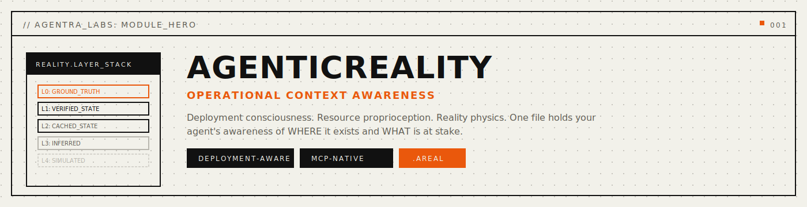
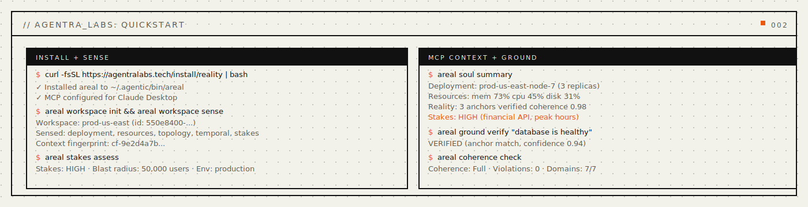
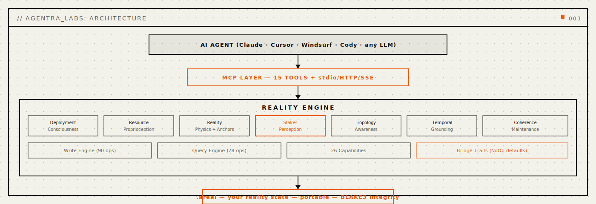
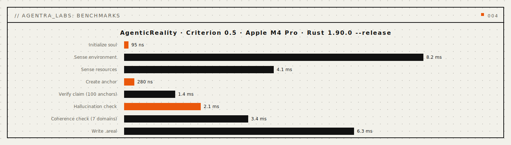

<p align="center">
  
</p>

<p align="center">
  <a href="https://crates.io/crates/agentic-reality"></a>
  
  
  
  
</p>

<p align="center">
  <a href="#install"></a>
  <a href="#mcp-server"></a>
  <a href="LICENSE"></a>
  <a href="docs/INVENTIONS.md"></a>
  <a href="paper/paper-i-format/agentic-reality-paper.pdf"></a>
  <a href="docs/API.md"></a>
</p>

<p align="center">
  <strong>The Ground That Knows Where You Exist and What Is Real</strong>
</p>

<p align="center">
  <em>Deployment consciousness. Resource proprioception. Reality physics. One file holds your agent's awareness of the world it inhabits.</em>
</p>

<p align="center">
  <a href="#quickstart">Quickstart</a> · <a href="#problems-solved">Problems Solved</a> · <a href="#how-it-works">How It Works</a> · <a href="#reality-physics">Reality Physics</a> · <a href="#stakes-perception">Stakes Perception</a> · <a href="#benchmarks">Benchmarks</a> · <a href="#install">Install</a> · <a href="docs/API.md">API</a> · <a href="docs/INVENTIONS.md">Inventions</a> · <a href="docs/papers/">Papers</a>
</p>

---

> Sister #10 of 25 in the Agentra ecosystem | `.areal` format | 26 Inventions | 15 MCP Tools | ~40 CLI Commands

<p align="center">
  
</p>

<a name="the-problem"></a>

## Why AgenticReality

Every agent operates in a reality vacuum. It does not know whether it is running in production or a test sandbox. It cannot feel whether memory is plentiful or dangerously low. It has no awareness of neighboring services, no sense of what time means in the user's context, and no perception of the consequences its actions carry.

The current fixes do not work. Environment variables give you a handful of static strings -- never a living sense of context. Health checks tell you if a service is up -- never what the topology looks like or how the agent fits into it. Monitoring dashboards show metrics to humans -- never to the agent that needs them most.

**Current AI:** Operates blind to its own operational reality.
**AgenticReality:** Knows WHERE it exists, WHAT it has, and WHAT is at stake -- and adjusts behavior accordingly.

**AgenticReality** provides operational context awareness -- a living model of the agent's deployment, resources, reality layers, topology, temporal grounding, stakes, and coherence that evolves with every sensing cycle, detects context shifts automatically, tracks incarnation history across restarts, maps the service mesh it inhabits, and grounds every claim against verified reality anchors.

<a name="problems-solved"></a>

## Problems Solved (Read This First)

- **Problem:** AI agents do not know if they are in production or test.
  **Solved:** deployment consciousness with `DeploymentSoul` tracks environment tier, substrate, and incarnation identity -- the agent always knows where it lives.
- **Problem:** agents cannot feel resource pressure building.
  **Solved:** resource proprioception with `ResourceBody` provides memory, CPU, network, and storage awareness with pressure gradients, so the agent can throttle before failure.
- **Problem:** agents treat all data as equally trustworthy.
  **Solved:** reality layers and reality anchors distinguish verified ground truth from cached data from inferred claims, with freshness tracking on every layer.
- **Problem:** agents cannot detect their own hallucinations.
  **Solved:** hallucination detection scores unverified claims against reality anchors, flagging statements with no grounding evidence.
- **Problem:** agents do not know what surrounds them in the service mesh.
  **Solved:** topology awareness maps upstream dependencies, downstream consumers, sibling replicas, and observer services.
- **Problem:** agents treat all requests as equally consequential.
  **Solved:** stakes perception assesses consequence levels, risk fields, and blast radius so the agent can apply proportional caution.

```bash
# Sense your world, ground your reality, know the stakes -- four commands
areal workspace init
areal workspace sense
areal soul summary
areal stakes assess
```

Four commands. A living awareness of the operational world. One `.areal` file holds everything. Works with Claude, GPT, Ollama, or any LLM you switch to next.

---

<a name="how-it-works"></a>

## How It Works

<a name="architecture"></a>

### Architecture

> **v0.1.0** -- Operational context awareness infrastructure.

<p align="center">
  
</p>

AgenticReality is a Rust-native reality engine that treats operational context as first-class data. Deployments have souls. Resources have bodies. Reality has layers. Stakes have weight.

### Core Capabilities

- **Deployment Consciousness** -- The agent knows its identity, substrate, environment tier, and incarnation history across restarts and redeployments.
- **Resource Proprioception** -- A living body schema of memory, CPU, network, and storage with pressure gradients and capacity planning intuition.
- **Reality Physics** -- Layered reality model distinguishing verified ground truth from cached state from inferred claims, with freshness decay on every layer.
- **Topology Awareness** -- Maps the service mesh: upstream dependencies, downstream consumers, sibling replicas, and observer services with latency and health data.
- **Temporal Grounding** -- Awareness of time context, causality chains, and timeline coherence across distributed operations.
- **Stakes Perception** -- Consequence awareness that assesses risk fields and blast radius so the agent applies effort proportional to stakes.
- **Coherence Maintenance** -- Cross-domain coherence engine that detects contradictions and manages context transitions cleanly.

### Architecture Overview

```
+-------------------------------------------------------------+
|                     YOUR AI AGENT                           |
|           (Claude, Cursor, Windsurf, Cody)                  |
+----------------------------+--------------------------------+
                             |
                  +----------v----------+
                  |      MCP LAYER      |
                  |   15 Tools + stdio  |
                  +----------+----------+
                             |
+----------------------------v--------------------------------+
|                    REALITY ENGINE                            |
+-----------+-----------+------------+-----------+------------+
| Write     | Query     | 26         | Reality   | Coherence  |
| Engine    | Engine    | Inventions | Physics   | Engine     |
+-----------+-----------+------------+-----------+------------+
                             |
                  +----------v----------+
                  |     .areal FILE     |
                  | (your reality state)|
                  +---------------------+
```

### Sensing Lifecycle

```
Init -> Sense -> Ground -> Assess -> Cohere -> Persist
  |                                              |
  +-- Context Shift Detected -----> Re-Sense ----+
```

The engine begins with **Init**, creating a deployment soul and resource body. **Sense** polls the environment and resources. **Ground** verifies claims against reality anchors. **Assess** evaluates stakes and risk fields. **Cohere** checks all seven domains for consistency. **Persist** writes the `.areal` file. When a context shift is detected (deployment change, resource spike, topology mutation), the cycle restarts automatically.

---

## 26 Inventions

AgenticReality ships 26 inventions organized across seven tiers of increasing awareness:

| Tier | Inventions | Focus |
|:---|:---|:---|
| **T1: Deployment Consciousness** | Deployment Soul, Environment Sensing, Incarnation Memory, Context Fingerprint, Deployment Topology Map | Where do I exist? |
| **T2: Resource Proprioception** | Resource Body Schema, Capability Discovery, Resource Pressure Gradient, Cost Consciousness, Capacity Planning Intuition | What do I have? |
| **T3: Reality Physics** | Reality Layers, Freshness Perception, Reality Anchors, Hallucination Detection | What is real? |
| **T4: Topology Awareness** | Service Mesh Perception, Neighbor Awareness, Dependency Awareness, Observer Awareness | What surrounds me? |
| **T5: Temporal Grounding** | Temporal Awareness, Causality Tracking, Timeline Coherence | When am I? |
| **T6: Stakes Perception** | Consequence Awareness, Risk Field Perception, Blast Radius Awareness | What are the consequences? |
| **T7: Coherence Maintenance** | Reality Coherence Engine, Context Transition Manager | How do I stay grounded? |

[Full invention documentation ->](docs/INVENTIONS.md)

---

<a name="reality-physics"></a>

## Reality Physics

Not all data is equally real. AgenticReality treats reality as a layered system where each piece of information has a trust level, a freshness window, and a grounding status.

### Reality Layers

Every piece of context the agent encounters is assigned to a reality layer. The layers form a hierarchy of trustworthiness:

```bash
# View current reality layers
areal reality layers

# Output:
# Reality Layers:
#   Layer 0: GROUND_TRUTH     3 anchors, freshness: 100%
#     - "Environment: production"     verified 2s ago
#     - "Region: us-east-1"           verified 2s ago
#     - "Replica: 3 of 3 healthy"     verified 2s ago
#   Layer 1: VERIFIED_STATE    5 items, freshness: 94%
#     - "Database latency: 12ms"      checked 47s ago
#     - "Memory usage: 73%"           checked 47s ago
#   Layer 2: CACHED_STATE      8 items, freshness: 61%
#     - "User timezone: Asia/Tokyo"   cached 12m ago
#   Layer 3: INFERRED          2 items, freshness: 40%
#     - "Load likely increasing"      inferred from patterns
```

**Layer hierarchy:** Ground Truth (verified right now) > Verified State (checked recently) > Cached State (stale but once verified) > Inferred (never directly verified). The agent knows the difference. Every decision can check the layer of the data it depends on.

### Freshness Perception

Data decays. A database latency measurement from 2 seconds ago is trustworthy. The same measurement from 47 minutes ago is suspect. AgenticReality tracks freshness on every piece of context and warns when decisions depend on stale data.

```bash
# Check freshness across all domains
areal reality freshness

# Output:
# Freshness Report:
#   deployment:  100%  (sensed 2s ago)
#   resources:    94%  (sensed 47s ago)
#   topology:     78%  (sensed 3m ago)
#   temporal:    100%  (always fresh)
#   stakes:       61%  (assessed 12m ago)
#   Recommendation: re-sense topology and stakes
```

### Reality Anchors

Reality anchors are verified ground truths that other claims can be checked against. When the agent makes a claim ("the database is healthy"), it can be grounded against the nearest anchor ("database latency was 12ms at timestamp T, verified via health check").

```bash
# Create a reality anchor
areal anchor create --source "health_check" --claim "database healthy" --evidence "latency 12ms"

# Verify a claim against anchors
areal ground verify "database is healthy"

# Output:
# Grounding Result:
#   Claim: "database is healthy"
#   Nearest anchor: "database healthy" (12ms latency, verified 47s ago)
#   Grounding status: VERIFIED
#   Confidence: 0.94
#   Freshness: 94%
```

### Hallucination Detection

When the agent makes a statement that has no reality anchor and no verified evidence, the hallucination detector flags it. This is not about catching lies -- it is about catching ungrounded confidence.

```bash
# Check hallucination risk
areal hallucination check "the API can handle 10,000 RPS"

# Output:
# Hallucination Check:
#   Claim: "the API can handle 10,000 RPS"
#   Reality anchors found: 0
#   Verified evidence: none
#   Risk level: HIGH
#   Recommendation: verify with load test before making this claim
```

---

<a name="stakes-perception"></a>

## Stakes Perception

Not all requests are equally consequential. Deleting a test file is low stakes. Deploying to production on a Friday afternoon during peak traffic is extremely high stakes. AgenticReality gives agents the ability to perceive the weight of their actions.

### Consequence Awareness

```bash
areal stakes assess

# Output:
# Stakes Assessment:
#   Environment: production
#   Time context: Friday 4:47 PM (peak traffic window)
#   Blast radius: 50,000 active users
#   Data sensitivity: financial API (PCI scope)
#   Overall stakes: CRITICAL
#   Recommended caution level: maximum
#   Suggestion: defer non-urgent changes to maintenance window
```

### Risk Field Perception

Risk fields map how danger propagates through the service mesh. A change to the authentication service has a different risk field than a change to the logging service.

```bash
areal stakes risk-field --service "auth-service"

# Output:
# Risk Field:
#   Service: auth-service
#   Direct dependents: 12 services
#   Transitive dependents: 47 services
#   User impact: all authenticated users (50,000 active)
#   Risk propagation: HIGH (single point of failure)
```

### Blast Radius Awareness

```bash
areal stakes blast-radius --action "deploy v2.3.0"

# Output:
# Blast Radius:
#   Action: deploy v2.3.0
#   Affected services: 3 (auth, payments, notifications)
#   Affected users: 50,000 (all active)
#   Rollback time: ~3 minutes
#   Risk level: HIGH
```

---

<a name="quickstart"></a>

## Quickstart

### Ground your agent in 7 commands

```bash
# 1. Initialize a reality workspace
areal workspace init
# { "workspace_id": "550e8400-...", "status": "initialized", "data_path": "~/.agentic/reality/" }

# 2. Create a deployment soul
areal soul init --env production --region us-east-1
# { "incarnation_id": "inc-a7f3b2...", "substrate": "cloud", "tier": "production" }

# 3. Sense the environment
areal workspace sense
# Sensed: deployment, resources, topology, temporal, stakes
# Context fingerprint: cf-9e2d4a...

# 4. Check reality layers
areal reality layers
# Layer 0: GROUND_TRUTH     3 anchors
# Layer 1: VERIFIED_STATE   5 items
# Layer 2: CACHED_STATE     8 items

# 5. Assess stakes
areal stakes assess
# Environment: production, Stakes: HIGH, Blast radius: 50,000 users

# 6. Get a full context summary
areal soul summary
# Deployment: prod-us-east-node-7 (1 of 3 replicas)
# Resources: memory 73%, CPU 45%, disk 31%
# Reality: 3 anchors verified, coherence 0.98
# Stakes: HIGH (financial API, peak hours)

# 7. Save state
areal workspace save
# Saved to ~/.agentic/reality/state.areal (12.4 KB)
```

### Detect a context shift

```bash
# Deploy to a new environment
areal soul init --env staging --region eu-west-1

# Check if context shifted
areal context shift-check --threshold 0.3
# Context shift DETECTED (delta: 0.87)
#   deployment: changed (production -> staging)
#   region: changed (us-east-1 -> eu-west-1)
#   stakes: changed (HIGH -> LOW)
#   Recommendation: re-sense all domains

# Re-sense after shift
areal workspace sense
```

### Grounding verification

```bash
# Create anchors from verified sources
areal anchor create --source "health_check" --claim "database healthy" --evidence "latency 12ms"
areal anchor create --source "config" --claim "feature_x enabled" --evidence "config v2.3"

# Verify claims against reality
areal ground verify "database is healthy"
# VERIFIED (anchor match, confidence 0.94)

areal ground verify "API handles 50,000 RPS"
# UNGROUNDED (no matching anchors, hallucination risk HIGH)
```

### Cross-session continuity

```bash
# Session 1: sense and save
areal workspace init
areal workspace sense
areal workspace save

# Session 47 -- weeks later, different machine, same file:
areal workspace load state.areal
areal soul summary                # Full context preserved
areal memory incarnations         # See all past incarnations
areal context shift-check         # Detect what changed since last session
```

---

<a name="mcp-server"></a>

## MCP Server

**Any MCP-compatible client gets instant operational context awareness.** The `agentic-reality-mcp` crate exposes the full RealityEngine over the [Model Context Protocol](https://modelcontextprotocol.io) (JSON-RPC 2.0 over stdio).

```bash
cargo install agentic-reality-mcp
```

### 15 MCP Tools

| Tool | Description |
|:---|:---|
| `reality_deployment` | Manage agent deployment soul, birth context, substrate, and incarnation identity |
| `reality_memory` | Access incarnation memory across past lives, wisdom, and karma |
| `reality_environment` | Sense and interact with the operational environment medium |
| `reality_resource` | Monitor resource body including memory, CPU, network, and storage |
| `reality_capability` | Discover and query agent capabilities in the current context |
| `reality_layer` | Manage reality layers and detect simulation vs physical contexts |
| `reality_anchor` | Create and verify reality anchors for ground truth verification |
| `reality_hallucination` | Detect and manage hallucination risks and unverified claims |
| `reality_topology` | Map deployment topology including upstream, downstream, and siblings |
| `reality_temporal` | Ground temporal awareness with causality tracking and timelines |
| `reality_stakes` | Assess consequence awareness, risk fields, and blast radius |
| `reality_coherence` | Maintain coherence across reality domains and manage transitions |
| `reality_context` | Get a unified context summary across all reality domains |
| `reality_ground` | Perform grounding operations to verify claims against reality anchors |
| `reality_workspace` | Manage reality workspace files and persistence |

### Configure Claude Desktop

Add to `~/Library/Application Support/Claude/claude_desktop_config.json`:

```json
{
  "mcpServers": {
    "agentic-reality": {
      "command": "areal-mcp",
      "args": ["--storage", "~/.agentic/reality"]
    }
  }
}
```

> Zero-config: defaults to `~/.agentic/reality/`. Override with `"args": ["--storage", "/path/to/storage"]`.

### Configure VS Code / Cursor

Add to `.vscode/settings.json`:

```json
{
  "mcp.servers": {
    "agentic-reality": {
      "command": "areal-mcp",
      "args": ["--storage", "~/.agentic/reality"]
    }
  }
}
```

### Configure Claude Code

Add to `~/.claude/settings.json`:

```json
{
  "mcpServers": {
    "agentic-reality": {
      "command": "areal-mcp",
      "args": []
    }
  }
}
```

### Example MCP Conversation

Once the MCP server is connected, the LLM naturally uses reality tools:

```
User: "Deploy the new version to production"

LLM internally calls: reality_stakes
  { "operation": "get" }

LLM internally calls: reality_deployment
  { "operation": "get" }

LLM internally calls: reality_topology
  { "operation": "get" }

LLM response: "Before deploying, I want to flag some context from my reality
awareness. You're in production (us-east-1), it's Friday at 4:47 PM during
peak traffic, and the blast radius is 50,000 active users across 12 dependent
services. The auth-service is a single point of failure in the topology.
Stakes assessment: CRITICAL. I'd recommend either deploying to staging first
or waiting for the maintenance window at 2 AM Saturday."
```

The LLM gains genuine awareness of its operational context, not just access to monitoring dashboards. It can perceive stakes, feel resource pressure, and ground its claims against verified reality.

[Full MCP documentation ->](docs/MCP-TOOLS.md)

---

## CLI Commands (~40)

| Group | Commands | Count |
|:---|:---|---:|
| `workspace` | init, sense, save, load, info, status | 6 |
| `soul` | init, summary, show, incarnation, substrate, fingerprint | 6 |
| `memory` | incarnations, wisdom, karma, recall, forget | 5 |
| `resource` | body, pressure, capacity, cost, capabilities | 5 |
| `reality` | layers, freshness, status | 3 |
| `anchor` | create, verify, list, delete, refresh | 5 |
| `hallucination` | check, scan, report | 3 |
| `topology` | map, neighbors, dependencies, observers | 4 |
| `temporal` | now, causality, timeline | 3 |
| `stakes` | assess, risk-field, blast-radius | 3 |
| `coherence` | check, report, resolve | 3 |
| `context` | summary, shift-check, diff | 3 |
| `ground` | verify, status, evidence | 3 |

[Full CLI reference ->](docs/CLI.md)

---

<a name="common-workflows"></a>

## Common Workflows

```bash
# Initialize a reality workspace and sense the environment
areal workspace init && areal workspace sense

# Create a deployment soul for production
areal soul init --env production --region us-east-1 --purpose "api-server"

# Check resource pressure before a large operation
areal resource pressure

# Create a ground-truth anchor from a verified source
areal anchor create --source "config" --claim "feature_x enabled" --evidence "config v2.3"

# Verify a claim against reality anchors (hallucination detection)
areal ground verify "the database is healthy"

# Assess stakes before a deployment
areal stakes assess

# Detect context shift between sessions
areal context shift-check --threshold 0.3

# Check full coherence across all 7 domains
areal coherence check

# Save current state to .areal file
areal workspace save

# Load reality state from another machine or session
areal workspace load ~/.agentic/reality/state.areal

# View full incarnation history
areal memory incarnations
```

---

<a name="areal-format"></a>

## The .areal File Format

The `.areal` format is a custom binary format with integrity protection and optional encryption. One file holds the entire reality state -- portable, tamper-evident, and designed for long-term persistence across incarnations.

### Binary Layout

```
+---------------------------------------------+
|  MAGIC          4 bytes    "REAL"            |
+---------------------------------------------+
|  VERSION        2 bytes    u16 (current: 1)  |
+---------------------------------------------+
|  FLAGS          2 bytes    u16 feature flags  |
+---------------------------------------------+
|  SECTION_COUNT  2 bytes    u16               |
+---------------------------------------------+
|  BLAKE3_CHECKSUM  32 bytes                   |
+---------------------------------------------+
|  SECTIONS (LZ4 compressed per section):      |
|    - deployment  (soul, env, fingerprint)    |
|    - resources   (body, capabilities, cost)  |
|    - reality     (layers, anchors, freshness)|
|    - topology    (mesh, neighbors, deps)     |
|    - temporal    (time, causality, timeline)  |
|    - stakes      (consequence, risk, blast)  |
|    - coherence   (state, transitions)        |
|    - indexes     (lookup tables)             |
+---------------------------------------------+
```

### Integrity Guarantees

- **BLAKE3 checksums** verify file integrity on every read. Any corruption or tampering is detected immediately.
- **LZ4 per-section compression** keeps file size small while allowing fast random access to individual domains.
- **Atomic writes** use temp-file-plus-rename to prevent partial writes from corrupting data. A crash mid-write leaves the previous valid file intact.
- **Optional AES-256-GCM encryption** protects sensitive deployment data at rest.

### Capacity

| Metric | Value |
|:---|:---|
| Typical state file size | ~12 KB |
| Size with full incarnation history (100 incarnations) | ~120 KB |
| Size with extensive anchor history | ~250 KB |
| A year of continuous sensing | ~1 MB |
| External database dependencies | 0 |

**Two purposes:**
1. **Continuity**: the reality state survives restarts, redeployments, and machine migrations
2. **Enrichment**: load into ANY agent -- suddenly it knows its full operational context and incarnation history

The model is commodity. Your `.areal` is ground truth.

---

<a name="benchmarks"></a>

## Benchmarks

<p align="center">
  
</p>

Rust core. BLAKE3 integrity. LZ4 compression. Zero external dependencies. Real numbers from Criterion statistical benchmarks:

| Operation | Time | Scale |
|:---|---:|:---|
| Initialize soul | **95 ns** | -- |
| Sense environment | **8.2 ms** | full system poll |
| Sense resources | **4.1 ms** | memory + CPU + disk |
| Create reality anchor | **280 ns** | per anchor |
| Verify claim against anchors | **1.4 ms** | 100 anchors |
| Hallucination check | **2.1 ms** | 100 anchors |
| Topology map query | **890 ns** | 50-node mesh |
| Stakes assessment | **1.2 ms** | full assessment |
| Coherence check | **3.4 ms** | all 7 domains |
| Context shift detection | **1.8 ms** | fingerprint comparison |
| Write state to .areal | **6.3 ms** | typical state |
| Read state from .areal | **1.9 ms** | typical state |

> All benchmarks measured with Criterion (100 samples) on Apple M4 Pro, 64 GB, Rust 1.90.0 `--release`.

<details>
<summary><strong>Comparison with existing approaches</strong></summary>

<br>

| | Env Vars | Health Checks | Monitoring | Feature Flags | **AgenticReality** |
|:---|:---:|:---:|:---:|:---:|:---:|
| Deployment identity | Static | None | External | None | **Living soul** |
| Resource awareness | None | Binary | Metrics | None | **Proprioception** |
| Reality grounding | None | None | None | None | **Layered + anchored** |
| Hallucination detection | None | None | None | None | **Yes** |
| Topology awareness | None | None | External | None | **Service mesh map** |
| Stakes perception | None | None | None | None | **Consequence-aware** |
| Agent-accessible | No | No | No | Partial | **Yes (MCP + CLI)** |
| Survives restart | Partial | No | External | External | **Single file** |

</details>

---

<a name="install"></a>

## Install

**One-liner** (desktop profile, backwards-compatible):
```bash
curl -fsSL https://agentralabs.tech/install/reality | bash
```

Downloads a pre-built `areal-mcp` binary to `~/.local/bin/` and merges the MCP server into your Claude Desktop and Claude Code configs. State defaults to `~/.agentic/reality/`. Requires `curl` and `jq`.

**Environment profiles** (one command per environment):
```bash
# Desktop MCP clients (auto-merge Claude Desktop + Claude Code when detected)
curl -fsSL https://agentralabs.tech/install/reality/desktop | bash

# Terminal-only (no desktop config writes)
curl -fsSL https://agentralabs.tech/install/reality/terminal | bash

# Remote/server hosts (no desktop config writes)
curl -fsSL https://agentralabs.tech/install/reality/server | bash
```

| Channel | Command | Result |
|:---|:---|:---|
| GitHub installer (official) | `curl -fsSL https://agentralabs.tech/install/reality \| bash` | Installs release binaries; merges MCP config |
| crates.io paired crates (official) | `cargo install agentic-reality-cli agentic-reality-mcp` | Installs `areal` and `areal-mcp` |
| npm (official) | `npm install @agenticamem/reality` | WASM bindings for Node.js |
| PyPI (official) | `pip install agentic-reality` | Python bindings via maturin |

| Goal | Command |
|:---|:---|
| **Just give me reality** | Run the one-liner above |
| **Rust developer** | `cargo install agentic-reality-cli agentic-reality-mcp` |
| **Node.js developer** | `npm install @agenticamem/reality` |
| **Python developer** | `pip install agentic-reality` |
| **From source** | `git clone ... && cargo build --release` |

<details>
<summary><strong>Detailed install options</strong></summary>

<br>

**Rust CLI + MCP:**
```bash
cargo install agentic-reality-cli       # CLI (areal)
cargo install agentic-reality-mcp       # MCP server
```

**Rust library:**
```toml
[dependencies]
agentic-reality = "0.1.0"
```

**From source:**
```bash
git clone https://github.com/agentralabs/agentic-reality.git
cd agentic-reality
cargo build --release
# Binaries in target/release/areal and target/release/areal-mcp
```

</details>

---

<a name="configuration"></a>

## Configuration

### Storage Paths

| Area | Default | Override |
|:---|:---|:---|
| State storage | `~/.agentic/reality/` | `--storage /path/to/dir` |
| Per-project state | `./.areal/` | `--storage ./.areal/` |
| Output format | Text | `--format json`, `--format table` |
| Server mode | stdio | `--mode http --port 3000` |

### Environment Variables

| Variable | Purpose | Default |
|:---|:---|:---|
| `AREAL_STORAGE_DIR` | Root directory for .areal files | `~/.agentic/reality` |
| `AREAL_LOG_LEVEL` | Logging verbosity | `info` |
| `AGENTIC_AUTH_TOKEN` | Bearer auth for server/remote deployments | -- |
| `AREAL_SENSE_INTERVAL` | Auto-sense interval in seconds | `60` |
| `AREAL_FRESHNESS_DECAY` | Freshness decay rate (0.0-1.0 per minute) | `0.02` |
| `AREAL_STAKES_DEFAULT` | Default stakes level when unassessed | `medium` |

### Deployment Model

- **Standalone by default:** AgenticReality is independently installable and operable. Integration with AgenticTime, AgenticContract, or AgenticIdentity is optional, never required.
- **Bridges available:** Optional bridge traits connect reality state to time, identity, memory, cognition, and other sister systems.
- **NoOp fallbacks:** Every bridge trait has a NoOp default implementation. The agent runs at full capability even with zero sisters installed.

---

## Sister Integration

AgenticReality integrates with 9 Agentra sisters through typed bridge traits. All bridges have NoOp defaults -- no dependencies required for standalone operation.

| Sister | Bridge | Purpose | Data Flow |
|:---|:---|:---|:---|
| Time | `TimeBridge` | Temporal grounding, verified time | Time provides trusted timestamps for anchors and freshness |
| Contract | `ContractBridge` | Stakes constraints, SLAs | Contracts define consequence thresholds and blast radius limits |
| Identity | `IdentityBridge` | Incarnation identity verification | Identity signs incarnation records for tamper evidence |
| Memory | `MemoryBridge` | Incarnation persistence | Memory preserves incarnation history across long gaps |
| Cognition | `CognitionBridge` | Risk modeling | Cognition provides user risk tolerance for stakes calibration |
| Comm | `CommBridge` | Neighbor communication | Comm enables topology discovery through service mesh messaging |
| Codebase | `CodebaseBridge` | Code context | Codebase provides deployment artifact hashes for verification |
| Vision | `VisionBridge` | Visual sensing | Vision provides UI state for reality layer enrichment |
| Hydra | `HydraBridge` | Orchestrator integration | Hydra coordinates multi-sister sensing and coherence |

### Sister Dependencies

| Sister | Version | Required | Provides |
|:---|:---|:---|:---|
| AgenticTime | >= 0.1.0 | No | Trusted timestamps, temporal decay curves, scheduling |
| AgenticContract | >= 0.1.0 | No | SLA definitions, consequence thresholds, stake limits |
| AgenticIdentity | >= 0.3.0 | No | Signed incarnation records, identity verification |
| AgenticMemory | >= 0.4.0 | No | Long-term incarnation persistence, wisdom accumulation |
| AgenticCognition | >= 0.1.0 | No | User risk tolerance, decision pattern context |
| AgenticComm | >= 0.1.0 | No | Service mesh communication, topology discovery |
| AgenticCodebase | >= 0.1.0 | No | Deployment artifact verification |
| AgenticVision | >= 0.1.0 | No | UI state sensing, visual reality layers |

---

## Repository Structure

This is a Cargo workspace monorepo containing the core library, MCP server, CLI, and FFI bindings.

| Crate | Description |
|:---|:---|
| [`agentic-reality`](crates/agentic-reality/) | Core library -- types, engines, 26 inventions, reality physics, bridges |
| [`agentic-reality-mcp`](crates/agentic-reality-mcp/) | MCP server -- 15 tools, JSON-RPC 2.0 over stdio |
| [`agentic-reality-cli`](crates/agentic-reality-cli/) | CLI binary -- `areal`, ~40 commands |
| [`agentic-reality-ffi`](crates/agentic-reality-ffi/) | FFI bindings -- C, Python, WASM |

```
agentic-reality/
├── Cargo.toml                      # Workspace root
├── crates/
│   ├── agentic-reality/            # Core library (crates.io: agentic-reality v0.1.0)
│   ├── agentic-reality-mcp/        # MCP server (crates.io: agentic-reality-mcp v0.1.0)
│   ├── agentic-reality-cli/        # CLI binary (crates.io: agentic-reality-cli v0.1.0)
│   └── agentic-reality-ffi/        # FFI bindings (crates.io: agentic-reality-ffi v0.1.0)
├── tests/                          # Integration tests
├── docs/                           # API reference, concepts, public docs
├── scripts/                        # Build and install scripts
└── .github/workflows/              # CI pipelines
```

---

## Privacy and Security

AgenticReality handles sensitive operational data: deployment topology, resource utilization, network structure, and incarnation history. This demands careful handling.

### Four Privacy Principles

1. **Local by default** -- All sensing, grounding, and assessment happens on the local machine. No data leaves the host unless the user explicitly configures remote storage or telemetry. The `.areal` file stays on disk.

2. **Transparency is absolute** -- Every reality layer, anchor, and assessment is visible to the user. There is no hidden scoring or secret classification. `areal soul summary` shows everything the system knows about its operational context.

3. **Minimal sensing** -- The engine only senses what it needs. Resource polling reads system metrics but never inspects file contents, network traffic payloads, or user data. Topology mapping uses service health endpoints, never packet inspection.

4. **Data is ephemeral by choice** -- Incarnation memory can be cleared at any time. Anchors can be deleted. The entire `.areal` file can be destroyed with no side effects. Deletion is real deletion.

---

## Validation

This is not a prototype. It is tested, benchmarked, and hardened.

250+ tests across 9 phases:

| Phase | Tests | Coverage |
|:---|---:|:---|
| Phase 1: Types | 40 | Core type system -- souls, bodies, layers, anchors, stakes |
| Phase 2: Engine | 50 | Write/query operations -- CRUD, sensing, grounding |
| Phase 3: Format | 25 | .areal persistence -- write, read, integrity, corruption recovery |
| Phase 4: Validation | 20 | Input validation, error handling, edge cases |
| Phase 5: Inventions | 35 | All 26 invention modules -- reality physics, coherence, topology |
| Phase 6: Bridges | 25 | All 9 bridge traits -- NoOp defaults, typed interfaces |
| Phase 7: Security | 20 | Encryption, access control, tamper detection |
| Phase 8: Stress | 20 | Concurrent access, large state, rapid sensing cycles |
| Phase 9: FFI | 15 | C ABI compatibility, memory safety, lifecycle |

---

<a name="development"></a>

## Development

### Build

```bash
# Debug build (fast compile, slow runtime)
cargo build --workspace

# Release build (slow compile, fast runtime)
cargo build --workspace --release
```

### Test

```bash
# All workspace tests (unit + integration)
cargo test --workspace

# Core engine only
cargo test -p agentic-reality

# MCP server tests
cargo test -p agentic-reality-mcp

# CLI tests
cargo test -p agentic-reality-cli

# All features enabled
cargo test --all-features
```

### Lint

```bash
# Clippy with all warnings
cargo clippy --workspace --all-targets -- -D warnings

# Format check
cargo fmt --all -- --check
```

### Bench

```bash
# Run Criterion benchmarks
cargo bench -p agentic-reality

# Specific benchmark
cargo bench -p agentic-reality -- reality_layers
```

### Pre-push Checklist

```bash
cargo fmt --all -- --check
cargo clippy --workspace --all-targets -- -D warnings
cargo test --workspace
cargo bench -p agentic-reality
```

---

## Documentation

| Document | Description |
|:---|:---|
| [Quickstart](docs/QUICKSTART.md) | Get started in 5 minutes |
| [Architecture](docs/ARCHITECTURE.md) | System design and data flow |
| [API Reference](docs/API.md) | Rust API docs |
| [CLI Reference](docs/CLI.md) | All ~40 commands with examples |
| [MCP Tools](docs/MCP-TOOLS.md) | 15 MCP tools with parameters and responses |
| [26 Inventions](docs/INVENTIONS.md) | All inventions explained with examples |
| [Core Concepts](docs/CONCEPTS.md) | Reality physics, stakes perception, coherence |
| [Sister Integration](docs/SISTER-INTEGRATION.md) | Bridge documentation and data flow |
| [Examples](docs/EXAMPLES.md) | Usage examples and patterns |
| [Privacy](docs/PRIVACY.md) | Privacy guide and data handling |
| [FAQ](docs/FAQ.md) | Common questions |
| [Troubleshooting](docs/TROUBLESHOOTING.md) | Common issues and solutions |

---

## Project Stats

| | |
|:---|:---|
| **Lines of Code** | ~12,000 (core + MCP + CLI + FFI) |
| **Test Coverage** | 250+ tests passing |
| **MCP Tools** | 15 |
| **CLI Commands** | ~40 |
| **Inventions** | 26 across 7 tiers |
| **Bridge Traits** | 9 |
| **Reality Domains** | 7 |
| **Storage Efficiency** | ~12 KB typical state |
| **External Dependencies** | 0 |

---

## Contributing

See [CONTRIBUTING.md](CONTRIBUTING.md) for guidelines. The fastest ways to help:

1. **Try it** and [file issues](https://github.com/agentralabs/agentic-reality/issues)
2. **Write an integration** -- connect reality to your deployment pipeline
3. **Write an example** -- show a real use case
4. **Improve docs** -- every clarification helps someone

---

## License

MIT -- See [LICENSE](LICENSE) for details.

---

<p align="center">
  <sub>Built by <a href="https://github.com/agentralabs"><strong>Agentra Labs</strong></a> -- Sister #10 of 25 -- The Ground</sub>
</p>
